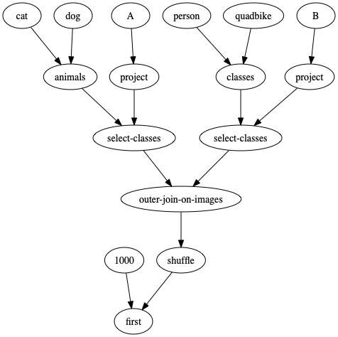
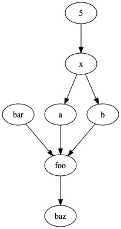

# Graphpack

Turn lambdas into graphs.

> (first 1000 (shuffle (outer-join-on-images (select-classes (animals cat dog) (project A)) (select-classes (classes person quadbike) (project B)))))

> (let (x 5) (a x) (b x) (baz (foo "bar" a b)))

